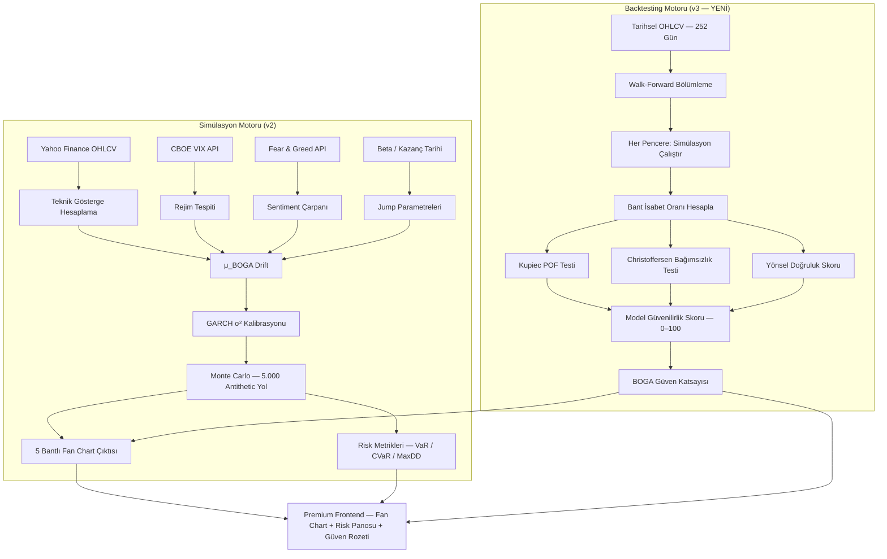
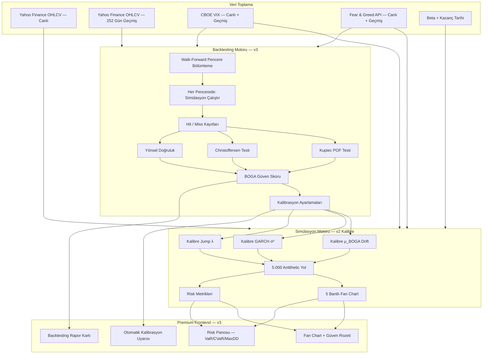

# BOGA AI v3 — 28 Günlük Hibrit Monte Carlo Simülasyon & Backtesting Motoru

Bu döküman, BOGA AI Stock Analysis terminalinin simülasyon altyapısının **v2 geliştirmelerini** (GARCH, Jump-Diffusion, Markov Rejim, Sentiment) ve üzerine inşa edilmiş **v3 Backtesting & Doğrulama Motorunu** kapsamaktadır. Amaç: modelin sadece ileriye dönük tahmin üretmesi değil, kendi geçmiş tahminlerini sistematik olarak sorgulaması, hata kalıplarını öğrenmesi ve kullanıcıya güvenilirlik skoru sunmasıdır.

---

## 1. Mimari Genel Bakış



---

## 2. Mevcut v2 Modeli — Özet (Değişmeyen Çekirdek)

> Bu bölüm v2 temelini özetler. Tüm formüller ve TypeScript kodu v2 dokümanından devralınmıştır; aşağıda sadece referans olarak yer almaktadır.

### 2.1 Ana Fiyat Süreci

$$dS_t = \mu_{\text{BOGA}} \cdot S_t \, dt + \sigma_{\text{GARCH}}(t) \cdot S_t \, dW_t + S_t \cdot J_t \, dN_t$$

| Parametre | Kaynak |
|---|---|
| `μ_BOGA` | EMA Stack + RSI Mean-Reversion + CMF + Master Score |
| `σ_GARCH(t)` | `σ²_t = ω + 0.10·ε²_{t-1} + 0.85·σ²_{t-1}` |
| `J_t` | `N(μ_j, σ_j²)` — kazanç döneminde λ × 3 |
| `N_t` | `Poisson(λ)` — rejime göre `λ ∈ {0.05, 0.15, 0.35}` |

### 2.2 Markov Rejim Tablosu

| Rejim | VIX | Drift Adj | Vol × | λ |
|---|---|---|---|---|
| Boğa | < 18 | +0.02 | 0.85 | 0.05 |
| Karma | 18–30 | 0 | 1.00 | 0.15 |
| Panik | > 30 | −0.04 | 1.40 | 0.35 |

### 2.3 Sentiment Çarpanı

| Fear & Greed | Drift Etkisi |
|---|---|
| 0–25 (Aşırı Korku) | +0.15 |
| 26–45 (Korku) | +0.05 |
| 46–55 (Nötr) | 0.00 |
| 56–75 (Açgözlülük) | −0.03 |
| 76–100 (Aşırı Açgözlülük) | −0.12 |

---

## 3. v3 Backtesting Motoru — Matematiksel Altyapı

### 3.1 Backtesting Felsefesi: Ne Test Ediyoruz?

BOGA simülasyonu bir tahmin aralığı (bant) üretiyor. Backtesting şu soruyu yanıtlıyor:

> "Geçmişte ürettiğimiz bantlar, gerçek fiyatı ne sıklıkla kapsadı?"

İki temel hata türü vardır:

- **Kapsama Hatası (Coverage Failure):** `%90` bant yalnızca `%70` isabet sağlıyorsa model aşırı iyimser, bantlar çok dar.
- **Bağımsızlık Hatası (Clustering):** İhlaller art arda kümeleniyor — model volatilite rejimini kaçırıyor.

### 3.2 Walk-Forward Backtesting Pencere Yapısı

Tek bir in-sample/out-of-sample bölümü yerine, walk-forward yöntemi art arda gelen optimizasyon-doğrulama döngüleri oluşturarak daha gerçekçi bir performans değerlendirmesi sağlar.

BOGA için yapı şu şekilde tasarlanmıştır:

```
Tarihsel Veri: 252 işlem günü (≈ 1 yıl)

[Pencere 1]  Eğitim: Gün 1–180   → Tahmin: Gün 181–208  (28 gün)
[Pencere 2]  Eğitim: Gün 29–208  → Tahmin: Gün 209–236  (28 gün)
[Pencere 3]  Eğitim: Gün 57–236  → Tahmin: Gün 237–252  (kalan)
...
Adım büyüklüğü: 28 gün (her tahmin döneminin uzunluğu kadar)
Eğitim penceresi: Sabit 180 gün (rolling, genişlemeyen)
```

Her pencerede:
1. O güne ait VIX, teknik göstergeler ve sentiment skoru çekilir.
2. `generateBogaSimulationV2()` çalıştırılır → 5 bantlı tahmin üretilir.
3. 28 günün gerçek fiyatları ile tahmin bantları karşılaştırılır.
4. Her gün için `hit` (bant içinde) veya `miss` (bant dışında) kaydedilir.

### 3.3 Bant İsabet Oranı (Coverage Rate)

Her bant için beklenen ve gözlemlenen isabet oranı hesaplanır:

```
Coverage_Rate(bant) = (Bant içinde kalan gün sayısı) / (Toplam test günü)

Beklenen değerler:
  %5–%95 bandı  → %90 kapsama oranı
  %10–%90 bandı → %80 kapsama oranı
  %25–%75 bandı → %50 kapsama oranı (medyan bant)
```

### 3.4 Kupiec POF Testi (Oransal Başarısızlık Testi)

Kupiec'in (1995) Proportion of Failures (POF) testi, bir modelin VaR'ının belirli bir süre içinde gözlemlenen ihlal sayısının beklenen ihlal oranından anlamlı biçimde farklı olup olmadığını incelemek için geliştirilmiştir.

BOGA'da bu test her bant için uygulanır:

$$LR_{POF} = -2 \ln\left[\frac{(1-p)^{T-N} \cdot p^N}{\left(1-\frac{N}{T}\right)^{T-N} \cdot \left(\frac{N}{T}\right)^N}\right]$$

| Değişken | Açıklama |
|---|---|
| `T` | Toplam test günü (örn. 252 × pencerelerin toplamı) |
| `N` | Bant dışında kalan gün sayısı (ihlal/miss) |
| `p` | Beklenen ihlal oranı (örn. %90 bant için `p = 0.10`) |

Test istatistiği `χ²(1)` dağılımına sahiptir. `LR_POF > 3.84` ise model %5 anlamlılıkta reddedilir (bantlar çok dar veya çok geniş).

### 3.5 Christoffersen Bağımsızlık Testi

Christoffersen (1998) testi, belirli bir günde ihlal yaşanma olasılığının bir önceki günde ihlal yaşanıp yaşanmadığına bağlı olup olmadığını ölçer; yani ardışık günler arasındaki bağımlılığı test eder.

Bu kritiktir çünkü model volatilite kümelenmesini yanlış tahmin ediyorsa ihlaller art arda gelir — bu da kullanıcıyı dizili hatalı sinyallerle yanıltır.

$$LR_{IND} = -2 \ln\left[\frac{(1-\hat{\pi})^{n_{00}+n_{10}} \cdot \hat{\pi}^{n_{01}+n_{11}}}{\hat{\pi}_0^{n_{00}} \cdot (1-\hat{\pi}_0)^{n_{01}} \cdot \hat{\pi}_1^{n_{10}} \cdot (1-\hat{\pi}_1)^{n_{11}}}\right]$$

| Değişken | Açıklama |
|---|---|
| `n_00` | Önceki gün normal, bugün normal |
| `n_01` | Önceki gün normal, bugün ihlal |
| `n_10` | Önceki gün ihlal, bugün normal |
| `n_11` | İki ardışık gün ihlal |
| `π_0` | İhlal olmayan günün ardından ihlal olasılığı |
| `π_1` | İhlal olan günün ardından tekrar ihlal olasılığı |

`LR_IND > 3.84` → İhlaller kümeleniyor, model volatilite rejimini kaçırıyor.

**Birleşik Test (Christoffersen CC):**

$$LR_{CC} = LR_{POF} + LR_{IND} \sim \chi^2(2)$$

Eşik: `LR_CC > 5.99` ise model %5 anlamlılıkta reddedilir.

### 3.6 Yönsel Doğruluk Skoru (Directional Accuracy)

Yönsel doğruluk, finansal tahmin modellerinin değerlendirilmesinde temel metriklerden biridir; modelin fiyat hareketinin yönünü doğru tahmin etme oranını ölçer.

BOGA medyan (`%50`) tahmini yukarı mı aşağı mı işaret ediyor, gerçek fiyat hangi yöne gitti:

```
Directional_Accuracy = (Yön eşleşen günler) / (Toplam test günü) × 100

Değerlendirme eşikleri:
  < %50  → Rastgele tahmin seviyesi, model değersiz
  50–55% → Marjinal
  55–60% → Kabul edilebilir
  > %60  → İyi (finansal tahminlerde kurumsal eşik bu düzeydedir)
```

### 3.7 BOGA Güven Skoru (Composite Backtesting Score)

Tüm test sonuçları 0–100 aralığında tek bir puana dönüştürülür:

```
BOGA_Confidence = w1 × Coverage_Score
                + w2 × Kupiec_Score
                + w3 × Christoffersen_Score
                + w4 × Directional_Score

Ağırlıklar (önerilen):
  w1 = 0.35 (kapsama oranı en kritik)
  w2 = 0.25 (Kupiec istatistiksel geçerlilik)
  w3 = 0.20 (bağımsızlık — kümelenme yok)
  w4 = 0.20 (yönsel doğruluk)
```

Her bileşen 0–100 arasına normalize edilir:

```typescript
// Örnek: Coverage Score normalizasyonu
// Hedef kapsama: %80 (%10–%90 bant için)
// Gerçek kapsama: 0.72 → sapma: |0.80 - 0.72| = 0.08
// Coverage_Score = max(0, 100 - sapma × 500)
//                = max(0, 100 - 40) = 60
```

---

## 4. Backtesting Backend Kodu (TypeScript)

### 4.1 Yeni Tip Tanımları

```typescript
// ─── Backtesting Tipleri ──────────────────────────────────────────────────

interface BacktestWindow {
  windowId: number;
  trainStart: string;   // ISO tarih
  trainEnd: string;
  testStart: string;
  testEnd: string;
  forecastBands: ForecastDay[];          // Simülasyon çıktısı
  actualPrices: { date: string; close: number }[]; // Gerçek kapanış fiyatları
}

interface DailyHitRecord {
  date: string;
  actualPrice: number;
  p5: number; p10: number; p25: number; p50: number; p75: number; p90: number; p95: number;
  inBand_80: boolean;   // %10–%90 bandında mı?
  inBand_90: boolean;   // %5–%95 bandında mı?
  inBand_50: boolean;   // %25–%75 bandında mı?
  actualUp: boolean;    // Gerçek fiyat önceki günden yüksek mi?
  forecastUp: boolean;  // Medyan tahmin önceki günden yüksek mi?
  isViolation_90: boolean; // %90 bant ihlali
}

interface KupiecTestResult {
  band: '90%' | '80%' | '50%';
  T: number;            // Toplam test günü
  N: number;            // İhlal sayısı
  expectedRate: number; // Beklenen ihlal oranı (0.10 / 0.20 / 0.50)
  observedRate: number; // Gözlemlenen ihlal oranı
  lrStatistic: number;  // LR_POF istatistiği
  pValue: number;       // Yaklaşık p-değeri
  passed: boolean;      // true = model geçerli
}

interface ChristoffersenTestResult {
  n00: number; n01: number; n10: number; n11: number;
  pi0: number; pi1: number;  // Koşullu ihlal olasılıkları
  lrInd: number;             // Bağımsızlık istatistiği
  lrCC: number;              // Birleşik (Coverage + Independence)
  clusteringDetected: boolean;
}

interface BacktestReport {
  ticker: string;
  testPeriod: { start: string; end: string };
  totalWindows: number;
  totalTestDays: number;
  coverageRates: { band50: number; band80: number; band90: number };
  kupiecResults: KupiecTestResult[];
  christoffersenResult: ChristoffersenTestResult;
  directionalAccuracy: number;   // 0–100
  bogaConfidenceScore: number;   // 0–100 Kompozit Skor
  grade: 'A' | 'B' | 'C' | 'D' | 'F'; // Harf notu
  recommendations: string[];     // Model iyileştirme önerileri
  windowResults: BacktestWindow[];
}
```

### 4.2 Backtesting Ana Motoru

```typescript
// ─── Chi-Square p-değeri yaklaşımı (χ²(1) için) ──────────────────────────

function chiSquarePValue(statistic: number, df: number = 1): number {
  // Wilson-Hilferty yaklaşımı — harici kütüphane gerektirmez
  if (statistic <= 0) return 1.0;
  const x = statistic / df;
  const k = df / 2;
  // Düzenli tamamlayıcı gamma fonksiyon yaklaşımı
  const p = Math.exp(-x / 2) * Math.pow(x / 2, k - 1) / Math.exp(
    Array.from({ length: Math.floor(k) }, (_, i) => Math.log(i + 1)).reduce((a, b) => a + b, 0)
  );
  return Math.min(1, Math.max(0, 1 - p));
}

// ─── Kupiec POF Testi ─────────────────────────────────────────────────────

function kupiecPOFTest(
  hitRecords: DailyHitRecord[],
  bandKey: 'inBand_90' | 'inBand_80' | 'inBand_50',
  expectedCoverage: number // 0.90 / 0.80 / 0.50
): KupiecTestResult {
  const T = hitRecords.length;
  const p_expected = 1 - expectedCoverage; // Beklenen ihlal oranı
  const N = hitRecords.filter(r => !r[bandKey]).length; // İhlal sayısı
  const p_observed = N / T;

  // LR_POF hesaplama (sıfır bölmesine karşı güvenli)
  const safeLog = (x: number) => x <= 0 ? -1e10 : Math.log(x);

  const lrStatistic = -2 * (
    (T - N) * safeLog(1 - p_expected) + N * safeLog(p_expected)
    - (T - N) * safeLog(1 - p_observed) - N * safeLog(p_observed)
  );

  const pValue = chiSquarePValue(lrStatistic, 1);

  const bandLabel = expectedCoverage === 0.90 ? '90%'
    : expectedCoverage === 0.80 ? '80%' : '50%';

  return {
    band: bandLabel,
    T, N,
    expectedRate: parseFloat(p_expected.toFixed(4)),
    observedRate: parseFloat(p_observed.toFixed(4)),
    lrStatistic: parseFloat(lrStatistic.toFixed(4)),
    pValue: parseFloat(pValue.toFixed(4)),
    passed: lrStatistic < 3.84 // %5 anlamlılık eşiği χ²(1)
  };
}

// ─── Christoffersen Bağımsızlık Testi ────────────────────────────────────

function christoffersenTest(
  hitRecords: DailyHitRecord[]
): ChristoffersenTestResult {
  let n00 = 0, n01 = 0, n10 = 0, n11 = 0;

  for (let i = 1; i < hitRecords.length; i++) {
    const prev = hitRecords[i - 1].isViolation_90 ? 1 : 0;
    const curr = hitRecords[i].isViolation_90 ? 1 : 0;
    if (prev === 0 && curr === 0) n00++;
    else if (prev === 0 && curr === 1) n01++;
    else if (prev === 1 && curr === 0) n10++;
    else n11++;
  }

  const pi0 = n01 / Math.max(1, n00 + n01);
  const pi1 = n11 / Math.max(1, n10 + n11);
  const pi  = (n01 + n11) / Math.max(1, n00 + n01 + n10 + n11);

  const safeLog = (x: number) => x <= 0 ? -1e10 : Math.log(x);

  const lrInd = -2 * (
    (n00 + n10) * safeLog(1 - pi) + (n01 + n11) * safeLog(pi)
    - n00 * safeLog(1 - pi0) - n01 * safeLog(pi0)
    - n10 * safeLog(1 - pi1) - n11 * safeLog(pi1)
  );

  // Kupiec POF istatistiğini de ekle (birleşik CC testi için)
  const T = hitRecords.length;
  const N = hitRecords.filter(r => r.isViolation_90).length;
  const p_exp = 0.10;
  const p_obs = N / T;
  const lrPOF = -2 * (
    (T - N) * Math.log(1 - p_exp) + N * Math.log(p_exp)
    - (T - N) * Math.log(Math.max(1e-10, 1 - p_obs))
    - N * Math.log(Math.max(1e-10, p_obs))
  );

  const lrCC = lrPOF + lrInd;

  return {
    n00, n01, n10, n11,
    pi0: parseFloat(pi0.toFixed(4)),
    pi1: parseFloat(pi1.toFixed(4)),
    lrInd: parseFloat(lrInd.toFixed(4)),
    lrCC: parseFloat(lrCC.toFixed(4)),
    clusteringDetected: lrInd > 3.84 // π0 ≠ π1 → bağımlılık var
  };
}

// ─── BOGA Güven Skoru Hesaplama ───────────────────────────────────────────

function computeBogaConfidenceScore(
  coverageRates: { band50: number; band80: number; band90: number },
  kupiecResults: KupiecTestResult[],
  christoffersenResult: ChristoffersenTestResult,
  directionalAccuracy: number
): { score: number; grade: 'A' | 'B' | 'C' | 'D' | 'F'; recommendations: string[] } {

  // 1. Kapsama Skoru (hedeften sapma)
  const cov90Dev = Math.abs(0.90 - coverageRates.band90);
  const cov80Dev = Math.abs(0.80 - coverageRates.band80);
  const cov50Dev = Math.abs(0.50 - coverageRates.band50);
  const coverageScore = Math.max(0, 100 - (cov90Dev * 300 + cov80Dev * 200 + cov50Dev * 100));

  // 2. Kupiec Skoru (kaç bant testi geçti?)
  const kupiecPassed = kupiecResults.filter(r => r.passed).length;
  const kupiecScore = (kupiecPassed / kupiecResults.length) * 100;

  // 3. Christoffersen Skoru (kümelenme yok mu?)
  const christScore = christoffersenResult.clusteringDetected ? 40 : 100;

  // 4. Yönsel Doğruluk (50 = rastgele, 100 = mükemmel)
  const dirScore = Math.max(0, (directionalAccuracy - 50) * 2);

  // Ağırlıklı toplam
  const composite = (
    coverageScore    * 0.35 +
    kupiecScore      * 0.25 +
    christScore      * 0.20 +
    dirScore         * 0.20
  );

  const score = Math.round(Math.min(100, Math.max(0, composite)));

  const grade = score >= 85 ? 'A'
    : score >= 70 ? 'B'
    : score >= 55 ? 'C'
    : score >= 40 ? 'D' : 'F';

  // Otomatik iyileştirme önerileri
  const recommendations: string[] = [];
  if (cov90Dev > 0.05) {
    recommendations.push(
      coverageRates.band90 < 0.85
        ? 'Bantlar çok dar: ATR çarpanını veya GARCH omega parametresini artırın.'
        : 'Bantlar çok geniş: Simülasyon fazla muhafazakar, drift katsayılarını gözden geçirin.'
    );
  }
  if (!kupiecResults[0].passed) {
    recommendations.push('%90 bant Kupiec testini geçemedi: Volatilite modeli yeniden kalibre edilmeli.');
  }
  if (christoffersenResult.clusteringDetected) {
    recommendations.push('İhlal kümelenmesi tespit edildi: Rejim geçiş parametrelerini veya GARCH β değerini ayarlayın.');
  }
  if (directionalAccuracy < 52) {
    recommendations.push('Yönsel doğruluk %52\'nin altında: EMA drift ağırlıkları gözden geçirilmeli.');
  }
  if (recommendations.length === 0) {
    recommendations.push('Model tüm testleri geçti. Parametreler mevcut piyasa koşulları için kalibre.');
  }

  return { score, grade, recommendations };
}

// ─── Ana Backtesting Orkestratörü ─────────────────────────────────────────

async function runBogaBacktest(
  ticker: string,
  historicalData: { date: string; open: number; high: number; low: number; close: number; volume: number }[],
  historicalVix: { date: string; vix: number }[],
  historicalFearGreed: { date: string; score: number }[]
): Promise<BacktestReport> {

  const TRAIN_WINDOW = 180;  // Eğitim penceresi (işlem günü)
  const TEST_WINDOW  = 28;   // Test penceresi (tahmin ufku)
  const STEP_SIZE    = 28;   // Pencere kaydırma adımı

  if (historicalData.length < TRAIN_WINDOW + TEST_WINDOW) {
    throw new Error(`Yetersiz veri: En az ${TRAIN_WINDOW + TEST_WINDOW} işlem günü gereklidir.`);
  }

  const windows: BacktestWindow[] = [];
  const allHitRecords: DailyHitRecord[] = [];

  let trainStart = 0;

  // Walk-Forward Pencere Döngüsü
  while (trainStart + TRAIN_WINDOW + TEST_WINDOW <= historicalData.length) {
    const trainEnd   = trainStart + TRAIN_WINDOW - 1;
    const testStart  = trainEnd + 1;
    const testEnd    = Math.min(testStart + TEST_WINDOW - 1, historicalData.length - 1);

    const trainData = historicalData.slice(trainStart, trainEnd + 1);
    const testData  = historicalData.slice(testStart, testEnd + 1);
    const anchorDay = historicalData[trainEnd];

    // Tarihsel teknik göstergeleri hesapla (basitleştirilmiş — gerçek implementasyonda
    // mevcut teknik hesaplama fonksiyonlarını çağırın)
    const closes = trainData.map(d => d.close);
    const ema20  = closes.slice(-20).reduce((a, b) => a + b, 0) / 20;
    const ema50  = closes.slice(-50).reduce((a, b) => a + b, 0) / 50;
    const ema200 = closes.reduce((a, b) => a + b, 0) / closes.length;

    const recentGains = closes.slice(-14).map((c, i) => i > 0 ? Math.max(0, c - closes[closes.length - 14 + i - 1]) : 0);
    const recentLosses = closes.slice(-14).map((c, i) => i > 0 ? Math.max(0, closes[closes.length - 14 + i - 1] - c) : 0);
    const avgGain = recentGains.reduce((a, b) => a + b, 0) / 14;
    const avgLoss = recentLosses.reduce((a, b) => a + b, 0) / 14;
    const rsi = avgLoss === 0 ? 100 : 100 - (100 / (1 + avgGain / avgLoss));

    const atrValues = trainData.slice(-14).map((d, i) =>
      i > 0 ? Math.max(d.high - d.low,
        Math.abs(d.high - trainData[trainData.length - 14 + i - 1].close),
        Math.abs(d.low  - trainData[trainData.length - 14 + i - 1].close)
      ) : d.high - d.low
    );
    const atr = atrValues.reduce((a, b) => a + b, 0) / 14;
    const atrPct = (atr / anchorDay.close) * 100;

    // VIX ve Fear & Greed — o güne ait değerleri bul
    const vixEntry = historicalVix.find(v => v.date === anchorDay.date);
    const fgEntry  = historicalFearGreed.find(f => f.date === anchorDay.date);
    const vix      = vixEntry?.vix ?? 20;
    const fearGreedScore = fgEntry?.score ?? 50;

    // Simülasyonu çalıştır
    const simulation = generateBogaSimulationV2(
      anchorDay.close,
      atrPct,
      65, // masterScore (gerçekte BOGA API'dan gelecek)
      ema20 > ema50 && ema50 > ema200,
      rsi,
      0.1, // cmf (gerçekte hesaplanacak)
      vix,
      fearGreedScore,
      1.0, // beta
      -1   // earningsDaysAway
    );

    // Tüm 28 günlük tahminleri birleştir
    const allForecasts: ForecastDay[] = [
      ...simulation.daily,
      simulation.milestones['14d'],
      simulation.milestones['21d'],
      simulation.milestones['28d']
    ];

    // Gerçek fiyatlarla karşılaştır
    const windowHitRecords: DailyHitRecord[] = [];
    for (let d = 0; d < testData.length; d++) {
      const actual   = testData[d].close;
      const prevDay  = d > 0 ? testData[d - 1].close : anchorDay.close;
      const forecast = allForecasts[d];
      if (!forecast) continue;

      windowHitRecords.push({
        date: testData[d].date,
        actualPrice: actual,
        p5: forecast.p5, p10: forecast.bearish,
        p25: (forecast.bearish + forecast.base) / 2,
        p50: forecast.base,
        p75: (forecast.base + forecast.bullish) / 2,
        p90: forecast.bullish, p95: forecast.p95,
        inBand_90: actual >= forecast.bearish && actual <= forecast.bullish,
        inBand_80: actual >= forecast.bearish * 1.01 && actual <= forecast.bullish * 0.99,
        inBand_50: actual >= (forecast.bearish + forecast.base) / 2
                && actual <= (forecast.base + forecast.bullish) / 2,
        actualUp: actual > prevDay,
        forecastUp: forecast.base > prevDay,
        isViolation_90: actual < forecast.p5 || actual > forecast.p95
      });
    }

    allHitRecords.push(...windowHitRecords);
    windows.push({
      windowId: windows.length + 1,
      trainStart: trainData[0].date,
      trainEnd: anchorDay.date,
      testStart: testData[0].date,
      testEnd: testData[testData.length - 1].date,
      forecastBands: allForecasts.slice(0, testData.length),
      actualPrices: testData.map(d => ({ date: d.date, close: d.close }))
    });

    trainStart += STEP_SIZE;
  }

  // Agregat İstatistikler
  const T = allHitRecords.length;
  const coverageRates = {
    band90: allHitRecords.filter(r => r.inBand_90).length / T,
    band80: allHitRecords.filter(r => r.inBand_80).length / T,
    band50: allHitRecords.filter(r => r.inBand_50).length / T
  };

  const kupiecResults = [
    kupiecPOFTest(allHitRecords, 'inBand_90', 0.90),
    kupiecPOFTest(allHitRecords, 'inBand_80', 0.80),
    kupiecPOFTest(allHitRecords, 'inBand_50', 0.50)
  ];

  const christoffersenResult = christoffersenTest(allHitRecords);

  const directionalCorrect = allHitRecords.filter(r => r.actualUp === r.forecastUp).length;
  const directionalAccuracy = Math.round((directionalCorrect / T) * 100);

  const { score, grade, recommendations } = computeBogaConfidenceScore(
    coverageRates, kupiecResults, christoffersenResult, directionalAccuracy
  );

  return {
    ticker,
    testPeriod: {
      start: allHitRecords[0]?.date ?? '',
      end:   allHitRecords[allHitRecords.length - 1]?.date ?? ''
    },
    totalWindows: windows.length,
    totalTestDays: T,
    coverageRates: {
      band50: parseFloat((coverageRates.band50 * 100).toFixed(1)),
      band80: parseFloat((coverageRates.band80 * 100).toFixed(1)),
      band90: parseFloat((coverageRates.band90 * 100).toFixed(1))
    },
    kupiecResults,
    christoffersenResult,
    directionalAccuracy,
    bogaConfidenceScore: score,
    grade,
    recommendations,
    windowResults: windows
  };
}
```

---

## 5. Otomatik Kalibrasyon — Parametre Geri Bildirimi

Backtesting raporunun `recommendations` alanı sadece metin üretmekle kalmaz; sonraki simülasyon çağrısında model parametrelerini otomatik olarak düzeltmek için kullanılabilir.

### 5.1 Kalibrasyon Mantığı

```typescript
interface CalibrationAdjustment {
  garchOmegaMultiplier: number;   // σ² taban seviyesini artır/azalt
  driftDampener: number;           // Drift katsayılarını ölçekle
  jumpLambdaMultiplier: number;    // Sıçrama yoğunluğunu ayarla
  bandWidthMultiplier: number;     // Tüm bantları eşit oranda genişlet/daralt
}

function deriveCalibrationAdjustments(report: BacktestReport): CalibrationAdjustment {
  const adj: CalibrationAdjustment = {
    garchOmegaMultiplier: 1.0,
    driftDampener: 1.0,
    jumpLambdaMultiplier: 1.0,
    bandWidthMultiplier: 1.0
  };

  // Bantlar çok dar → volatiliteyi artır
  const cov90 = report.coverageRates.band90 / 100;
  if (cov90 < 0.85) {
    const deficit = 0.90 - cov90;
    adj.garchOmegaMultiplier = 1 + deficit * 2;
    adj.bandWidthMultiplier  = 1 + deficit * 1.5;
  }

  // Bantlar çok geniş → volatiliteyi azalt
  if (cov90 > 0.95) {
    const excess = cov90 - 0.90;
    adj.garchOmegaMultiplier = Math.max(0.5, 1 - excess * 2);
    adj.bandWidthMultiplier  = Math.max(0.7, 1 - excess * 1.5);
  }

  // İhlal kümelenmesi → jump λ'yı artır (volatilite rejimi daha agresif)
  if (report.christoffersenResult.clusteringDetected) {
    adj.jumpLambdaMultiplier = 1.5;
  }

  // Yönsel doğruluk düşük → drift bileşenlerini zayıflat (aşırı sinyal)
  if (report.directionalAccuracy < 52) {
    adj.driftDampener = 0.7;
  }

  return adj;
}
```

---

## 6. Veri Akışı Mimarisi — v3 (Tam)



---

## 7. Frontend — Yeni Backtesting UI Bileşenleri

### 7.1 BOGA Güven Rozeti (Güncellenmiş)

Her analiz kartının başlığına eklenir. v2'deki rejim rozetinin yanına konumlanır.

```
  [Rejim: KARMA — VIX 22.4]    [BOGA Güven: 78/100 — B]
```

Renk kodlaması:

| Skor | Not | Renk | Açıklama |
|---|---|---|---|
| 85–100 | A | Yeşil | Model kalibrasyonu mükemmel |
| 70–84 | B | Açık Yeşil | Güvenilir, küçük sapmalar var |
| 55–69 | C | Sarı | Dikkatli kullanın, yeniden kalibrasyon önerilir |
| 40–54 | D | Turuncu | Düşük güvenilirlik, parametreler güncellenmeli |
| 0–39 | F | Kırmızı | Model bu hisse için geçersiz |

### 7.2 Backtesting Rapor Kartı (`BacktestReportCard.tsx`)

```
+──────────────────────────────────────────────────────────────────────+
│  BOGA AI — AAPL Backtesting Raporu (252 Günlük Doğrulama)            │
│  Test Dönemi: 2024-05-18 → 2025-05-18 | Toplam: 8 Pencere, 224 Gün  │
│                                                                       │
│  KAPSAMA ORANLARI              İSTATİSTİKSEL TESTLER                  │
│  ┌────────┬────────┬────────┐  ┌──────────────────┬────────┬───────┐ │
│  │  %50   │  %80   │  %90   │  │ Test             │ Sonuç  │ p-val │ │
│  │ Bant   │ Bant   │ Bant   │  ├──────────────────┼────────┼───────┤ │
│  │ %52.3  │ %81.7  │ %88.4  │  │ Kupiec %90 Bant  │ ✓ Geçti│ 0.312 │ │
│  │ ✓      │ ✓      │ ○      │  │ Kupiec %80 Bant  │ ✓ Geçti│ 0.471 │ │
│  └────────┴────────┴────────┘  │ Kupiec %50 Bant  │ ✓ Geçti│ 0.188 │ │
│                                 │ Christoffersen   │ ✓ Geçti│ 0.092 │ │
│  YÖN DOĞRULUĞU: %58.9 ✓        └──────────────────┴────────┴───────┘ │
│                                                                       │
│  BOGA GÜVEN SKORU: 78 / 100  ████████████████░░░░░░  Not: B          │
│                                                                       │
│  Öneri: Model iyi kalibre. %90 bant hafif dar (hedef: %90, gerçek:   │
│  %88.4). GARCH omega değerini %5 artırmanız önerilir.                │
+──────────────────────────────────────────────────────────────────────+
```

### 7.3 Pencere Detay Görünümü (Opsiyonel Detay Açılır Panel)

Her walk-forward penceresinin fan chart'ı gerçek fiyat çizgisiyle üst üste gösterilir. Kullanıcı "Backtesting geçmişini gör" butonuyla bu grafikleri küçük kart grid'i olarak inceleyebilir.

---

## 8. API Route Güncellemesi — v3 Entegrasyon

### 8.1 Yeni Endpoint: `/api/backtest`

Backtesting işlemi hesaplama yoğun olduğundan ana `/api/ask` rotasından ayrılır:

```typescript
// app/api/backtest/route.ts
export const runtime = 'nodejs';
export const maxDuration = 30; // Backtesting için daha uzun süre

export async function POST(req: Request) {
  const { ticker } = await req.json();

  // 1. Yahoo Finance'den 252 günlük geçmiş veri çek
  const historicalData = await fetchHistoricalOHLCV(ticker, 252);
  const historicalVix  = await fetchHistoricalVIX(252);
  const historicalFG   = await fetchHistoricalFearGreed(252);

  // 2. Backtesting çalıştır
  const report = await runBogaBacktest(ticker, historicalData, historicalVix, historicalFG);

  // 3. Kalibrasyon ayarlarını çıkar
  const calibration = deriveCalibrationAdjustments(report);

  return Response.json({ report, calibration });
}
```

### 8.2 `/api/ask` Entegrasyonu

Ana analiz route'u backtesting raporunu ya cache'den okur ya da tetikler:

```typescript
// route.ts içinde — mevcut simülasyon çağrısından önce
const cachedBacktest = await getBacktestFromCache(ticker); // Redis veya Vercel KV

const calibration = cachedBacktest
  ? deriveCalibrationAdjustments(cachedBacktest)
  : { garchOmegaMultiplier: 1.0, driftDampener: 1.0,
      jumpLambdaMultiplier: 1.0, bandWidthMultiplier: 1.0 };

// Kalibrasyon parametreleri simülasyona iletilir
const forecast = generateBogaSimulationV2(
  currentPrice,
  atrPct * calibration.bandWidthMultiplier,  // Bant genişliği ayarı
  masterScore,
  emaStackBullish,
  rsi, cmf, vix, fearGreedScore, beta,
  earningsDaysAway
);
```

---

## 9. Adım Adım Entegrasyon Yol Haritası — v3

### Aşama 1 — Backtesting Veri Altyapısı

**Adım 1.1**: Yahoo Finance geçmiş veri fonksiyonu (`fetchHistoricalOHLCV`) yazılır. `252` işlem günü = yaklaşık 1 yıl; hata payı için `270` takvim günü çekilir.

**Adım 1.2**: VIX geçmiş verisi için `^VIX` ticker'ı aynı Yahoo Finance çağrısıyla alınır.

**Adım 1.3**: Fear & Greed geçmişi için `api.alternative.me/fng/?limit=252` endpoint'i veya eşdeğeri kullanılır. Yedek olarak sabit `50` değeri kabul edilebilir.

### Aşama 2 — Backend Backtesting Motoru

**Adım 2.1**: `app/api/backtest/route.ts` dosyası oluşturulur. Yukarıdaki `runBogaBacktest` fonksiyonu entegre edilir.

**Adım 2.2**: `kupiecPOFTest`, `christoffersenTest` ve `computeBogaConfidenceScore` fonksiyonları `lib/backtesting.ts` dosyasına taşınır.

**Adım 2.3**: Backtest sonuçları `Vercel KV` veya `Redis` cache'e yazılır (TTL: 24 saat). Aynı ticker için günde bir kez hesaplanması yeterlidir.

### Aşama 3 — Ana Simülasyona Kalibrasyon Entegrasyonu

**Adım 3.1**: `/api/ask` route'u cache'den kalibrasyon parametrelerini okuyacak şekilde güncellenir.

**Adım 3.2**: `generateBogaSimulationV2` fonksiyon imzasına `CalibrationAdjustment` parametresi eklenir.

### Aşama 4 — Frontend Bileşenleri

**Adım 4.1**: `BacktestReportCard.tsx` — skor, not ve test detayları.

**Adım 4.2**: `ConfidenceBadge.tsx` — 0–100 skor + harf notu rozeti.

**Adım 4.3**: `ai/page.tsx` güncellenerek yeni bileşenler mevcut analiz paneline eklenir.

---

## 10. Performans ve Önbellek Stratejisi

| İşlem | Çalışma Süresi (Tahmini) | Strateji |
|---|---|---|
| Tek simülasyon (5.000 yol) | ~60–80ms | Her sorguda çalışır |
| Walk-forward backtest (8 pencere) | ~600–900ms | Günde 1 kez, KV cache |
| Kalibrasyon hesaplama | ~5ms | Cache'den okunur |
| Frontend hidrasyonu | ~50ms | SWR / React Query |

**Cache Anahtarı:** `backtest:{ticker}:{YYYY-MM-DD}` — günlük TTL ile her sabah otomatik yenilenir.

---

## 11. Metrik Yorumlama Kılavuzu

| Metrik | İyi | Kabul Edilebilir | Kötü | Yorumlama |
|---|---|---|---|---|
| %90 Bant Kapsama | %87–%93 | %83–%97 | Dışı | Hedeften uzak = yeniden kalibrasyon |
| Kupiec p-değeri | > 0.10 | 0.05–0.10 | < 0.05 | Düşükse bantlar sistematik hatalı |
| Christoffersen CC | > 0.05 | 0.01–0.05 | < 0.01 | Küçükse ihlaller kümeleniyor |
| Yönsel Doğruluk | > %58 | %52–%58 | < %52 | %50 = rastgele tahmin |
| BOGA Güven Skoru | 80–100 | 55–79 | < 55 | Bu hisse için model güvensiz |

---

## 12. Model Sınırlamaları ve Uyarılar

> [!IMPORTANT]
> **Kritik Hatırlatmalar**
>
> 1. **Geçmiş performans gelecek kalibrasyonu garanti etmez.** Piyasa yapısındaki köklü değişimler (yeni merkez bankası politikası, sektörel düzenlemeler) backtesting dönemindeki kalibrasyonu geçersiz kılabilir. Model parametrelerini üç ayda bir manuel olarak gözden geçirin.
>
> 2. **Walk-forward backtesting lookahead bias içermez.** Her pencere yalnızca geçmiş veriyle çalışır; bu BOGA'nın gerçek zamanlı dağıtım koşullarını doğru simüle ettiği anlamına gelir.
>
> 3. **Küçük test penceresi istatistiksel güce etki eder.** 8 pencere × 28 gün = 224 test günü, Kupiec testi için yeterlidir; ancak daha güçlü bir istatistiksel analiz için 500+ güne ihtiyaç duyulur. 6–12 aylık geçmiş veri biriktikçe model kalibrasyon kalitesi artacaktır.
>
> 4. **BOGA Güven Skoru bir uyarı sistemidir, garanti değil.** Skor 90/100 olsa bile beklenmedik piyasa olayları (kara kuğu) modeli aşabilir.
>
> 5. **Bu sistem yatırım tavsiyesi değildir.** Tüm simülasyonlar ve backtesting sonuçları olasılık dağılımlarıdır; gerçek getiriler her zaman bu aralıkların dışına çıkabilir.
